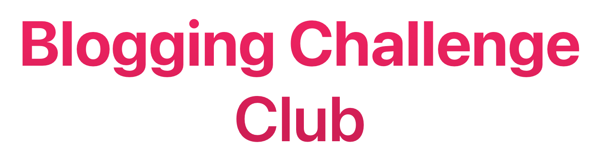

	

## What is this?

This is a challenge to help you get writing more regularly. The challenge is **31 days** long, and will last for the entirety of March 2021.

The idea is that you publish a blog post every single day, each one based on a topic from the list. You don't have to do them in order, but at the end of the month everyone will have written a blog post on the same 31 topics!

## What are the topics?

They've not been confirmed yet, as we are still trying to come up with them. If you have any ideas of what a topic could be, then [feel free to suggest them](https://airtable.com/shreoIttTh2KR1lXy).

## Can I join?

Anyone can take part! You can follow along with the topics here when they are confirmed, or if you want to be more involved, then there is a [Discord channel that you can join](http://bloggingclub.link).

